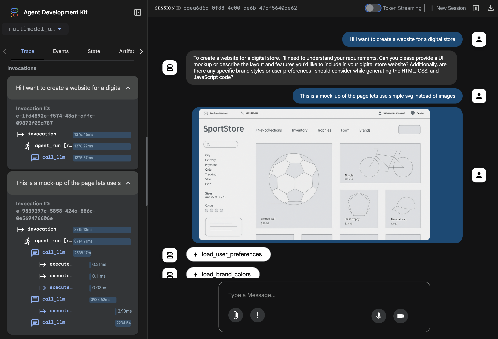

<a href="https://sambanova.ai/">
<picture>
  <source media="(prefers-color-scheme: dark)" srcset="../images/SambaNova-light-logo-1.png" height="60">
  
</picture>
</a>

# SambaNova ADK Integration

## Overview 

The [**Agent Development Kit (ADK)**](https://google.github.io/adk-docs/) is a flexible, modular framework for building AI agents—agnostic of models and deployment environments—designed to support workflows, tool ecosystems, and evaluation.

This demo shows how to use the [ADK](https://github.com/google-deepmind/adk) to build a multimodal agent that runs on SambaNova-hosted models. It features an agent capable of calling tools to generate a web UI from an image mockup using SambaNova's inference capabilities.

## Setting up the Environment

To get started, create a virtual environment and install the required dependencies, including the ADK library and LiteLLM for SambaNova model integration.

1. Create a Virtual Environment
Run the following commands to set up a virtual environment:

> Use python 3.9 or higher

``` bash
    python -m venv .venv
    source .venv/bin/activate
```

2. Install Dependencies
Once the environment is activated, install the necessary packages:

``` bash
    pip install -r requirements.txt
```

3. Set your SambaCloud API Key
Generate your SambaCloud API key [here](https://cloud.sambanova.ai/apis) and set it in the [`./multimodal_agent/.env`](./multimodal_agent/.env) 

``` bash
SAMBANOVA_API_KEY=<Your SAMBANOVA api key>
```

## Running the ADK Agent

Run the web UI with

``` bash
adk web
```

Then open [`http://localhost:8000`](http://localhost:8000) in your browser.
Select the multimodal agent and send a web page creation task to the agent.

You should see a page like this:



> In the [sample_data](./sample_data/mock.png) folder is included a mock example that can be sent to the agent to create the [html site](./output/sportstore.html)

## Customize the agent

You can modify the agent’s behavior by tweaking the instructions and description in [multimodal_agent/agent.py](./multimodal_agent/agent.py), o add or modify tools, edit [multimodal_agent/tools.py](./multimodal_agent/tools.py).
For or more complex workflows or multi-agent examples, refer to the[official ADK documentation](https://google.github.io/adk-docs/agents/).