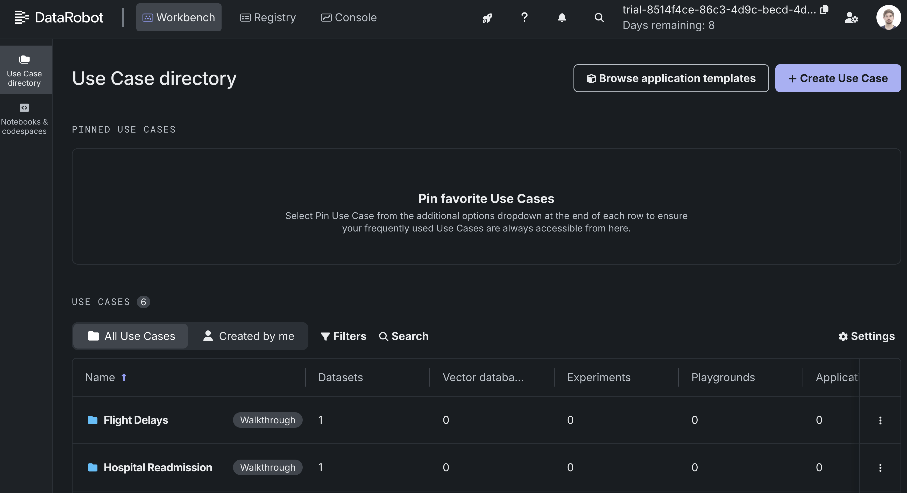

<a href="https://sambanova.ai/">
<picture>
 <source media="(prefers-color-scheme: dark)" srcset="../images/SambaNova-light-logo-1.png" height="60">
  
</picture>
</a>

DataRobot
======================

<!-- TOC -->

- [Overview](#overview)
- [Before you begin](#before-you-begin)
    - [Set up your SambaCloud account](#set-up-your-sambanova-account)
    - [Get your API credentials](#get-your-api-credentials)
    - [Access to DataRobot workbench](#access-to-datarobot-workbench)
- [Setting up the integration](#setting-up-the-integration)
    - [Set model environment](#set-model-environment)
    - [Create a new custom model](#create-a-new-custom-model)
    - [Configure runtime parameters](#configure-runtime-parameters)
    -[Register Model](#register-model)
- [Usage](#usage)
    - [Deploy the model](#deploy-the-model)
    - [Link the model to RAG application or Agentic Workflows](#link-the-model-to-rag-application-or-agentic-workflows)
    - [Use the model application](#use-the-model-application)

<!-- /TOC -->

# Overview
This guide walks you through integrating SambaNova Cloud models into DataRobot Workbench as a managed custom model. Once deployed, your model can be used seamlessly across RAG Playgrounds and Agentic Workflows.

With this setup, you can:

- Use SambaNova models directly inside **RAG** or **Agentic Workflows**
- Test chat completions from the **Playground**  
- Manage and monitor your LLMs through **DataRobot Deployments**

> **DataRobot** is an enterprise AI platform that lets you build, deploy, and govern predictive and generative AI models at scale.

# Before you begin

Before starting, make sure you have access to both SambaCloud (for your models) and DataRobot Workbench (for deployment and orchestration).

## Set up your SambaCloud account

1. Create an account at [SambaCloud](https://cloud.sambanova.ai).  
2. Log in and copy your API key from [cloud.sambanova.ai/apis](https://cloud.sambanova.ai/apis).

## Get your API credentials
You will need the following environment values:
- **`SAMBANOVA_API_KEY`** — your API key from the SambaNova Cloud portal  
- **`SAMBANOVA_API_BASE`** — `https://api.sambanova.ai/v1` (for SambaCloud) or your on-prem endpoint  
- **`SAMBANOVA_MODEL`** — model ID to use (e.g. `gpt-oss-120b`)

## Access to DataRobot workbench

Create an account in [DataRobot](https://app.datarobot.com/) app.

Make sure you have access to:
- **Registry** → to create custom models
- **Console** → to deploy them
- **Workbench** → to use them in a RAG application or in an Agentic Workflow

# Setting up the integration

This section explains how to configure the base environment, upload required files, and prepare runtime parameters for SambaNova API access.

## Set model environment

1- Go to the to **Registry** tab and select **Workshop** in the lateral menu and click on **+ Add Model** button.

2- Fill the add model configuration

- Set the **type** to `Proxy`
- Set **Model name** to `SambaNova Chat`
- Set **TargetType** to `Test Generation`
- Set **target** to `resultText`
- Click on **Add model** button

3- In the **assemble** tab choose `[GenAI] Python 3.12 with Moderations` from **Base environment** dropdown.

4- Upload the [requirements.txt](./requirements.txt) in the **files** section.

5- click on the **Build** button.

> After the environment is build you will get a message like this on in status section: `Environment built successfully`.

## Create a new custom model

The SambaNova connector runs as a custom Python script that defines a few special hooks used by `datarobot-drum` when the model receives requests.

Upload the [custom.py](./custom.py) script in the **files** section.

## Configure runtime parameters

The sambanova connector uses the run time parameters `SAMBANOVA_API_KEY`, `SAMBANOVA_API_BASE`, `SAMBANOVA_MODEL` to authenticate and route requests to SambaNova API.

1- Click on **Create** button the in the files section and select **Create model-metadata.yaml** template.

2- Paste contents of the [model-metadata.yaml](./model-metadata.yaml) configuration file into the editor and click **Save**.

3- Scroll down to view the new runtime parameters. You’ll see a table like this:

4- Click on the **Edit ✎** button in `SAMBANOVA_API_KEY` parameter.

5- Click on `Add credentials` in the **value dropdown**

6- In the new Add new credentials pop up set Credential type to `API token`, and add your SamabaNova API key

7- Click in **Save and sign in** and then in **↗️ Go back to model** button and select `SAMABNOVA_API_KEY` in **Value** dropdown of the **Edit key** panel.

> You can also edit the `SAMBANOVA_API_BASE`, `SAMBANOVA_MODEL` params depending of your used SambaNova environment

## Register Model

Click the top **Register a model** button at the top.
keep the default configuration and click on **register a model**.

> You can register new versions later—DataRobot automatically versions each upload.

# Usage

Once the model is registered, you can deploy and connect it to your RAG or Agentic workflows.

## Deploy the model

1- Go to **Models** in the **Registry** tab, then you will see your custom model.

2- Click in your model and desired version.

3- Click on **Deploy** and review your deployment configuration and click the **Deploy model** button.

After some minutes you will see your model in the **Deployments** section of the **Console** tab with status `active`.

## Link the model to RAG application or Agentic Workflow

1- Go to **Workbench** tab and click **+ Create Use Case** button.

2- Enter a name and select **✨ Playgrounds** on the **Generative AI** section.

3- Create a **RAG Playground**, Then in the playground click on **Create LLM blueprint**.

4- In the configuration right panel, open the **LLM** tab and click the **+ Select LLM** button. then click on **🔗 Add deployed LLM**.

5- In the **Add deployed LLM** pop up:
    - **Name** - any descriptive name (e.g. `Deployed model`)
    - **Deployment name** - select your deployed model (`SambaNova Chat`)
    - **Chat model ID** - set the desired model to use (e.g. `gpt-oss-120b`)

6- click in **Validate and add** you will get a notification with a message like this `Deployment validation succeeded; deployed LLM is available for use. Validation ID is 68ee893a1829a6c428721283.`

7- Reopen the **LLM** tab in the **Configuration** panel and click again on **+ Select LLM** button then choose your validated deployment.

7- Configure model parameters: context length, **validation ID**, and save.

Your RAG Playground is now connected to your custom SambaNova model through DataRobot’s model deployment layer.
You can start chatting, run retrieval-augmented prompts, or integrate your model into workflows.

> You can add a vector store, a system prompt, or tweak history management in configuration tabs.

Find more information in DataRobot official Docs:

- [DataRobot GenAI Documentation](https://docs.datarobot.com/en/docs/gen-ai/index.html)

- [DataRobot Custom models API reference](https://docs.datarobot.com/en/docs/api/reference/drum/index.html)

- [DataRobot GenAI Walkthrough](https://docs.datarobot.com/en/docs/get-started/gs-dr5/genai-walk-basic.html)
