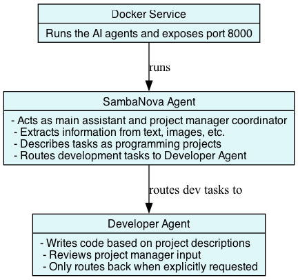

# Multimodal agents

A multi-agent system multimodal assistance built with Google Agent Development Kit (ADK). This
project features a coordinating agent (Main) that manages one specialized sub-agent (Sambanova) for different multimodal tasks.

## Architecture

The system consists of two main agents orchestrated by Docker Compose, which plays a
**primordial role** in launching and coordinating all agent services:

### 🐙 Docker Compose Orchestration

- **Central Role**: Docker Compose serves as the foundation for the entire multi-agent system
- **Service Orchestration**: Manages the lifecycle of all three agents (SambaNova and Developer)
- **Configuration Management**: Defines agent prompts, model configurations, and service dependencies
  directly in the compose file
- **Network Coordination**: Establishes secure inter-agent communication channels
- **Environment Management**: Handles API keys, model parameters, and runtime configurations

### SambaNova Components

### 🦆 Main (Main Agent)

- **Role**: SambaNova assistant and project coordinator
- **Model**: SambaNova Llama 4 Maverick (Llama-4-Maverick-17B-128E-Instruct)
- **Provider**: SambaNova API
- **Capabilities**: Describe multimodal info and routes requests to appropriate sub-agent based on user needs

### 🧠 Developer Agent

- **Role**: Developer and problem-solving
- **Model**: Qwen3-Coder
- **Specialization**: programming problem-solving scenarios

## Features

- **Multi-agent coordination**: Routing between specialized agents
- **Multimodal expertise**: One agent specializes in multimodal (text and image)
- **Coding expertise**: All agents specialize in coding
- **FastAPI web interface**: RESTful API with web interface support
- **Docker containerization**: Easy deployment with Docker Compose

## Quick Start

### Prerequisites

- **[Docker Desktop] 4.43.0+ or [Docker Engine]** installed.
- **A laptop or workstation with a GPU** (e.g., a MacBook) for running open models locally. If you
  don't have a GPU, you can alternatively use **[Docker Offload]**.
- If you're using [Docker Engine] on Linux or [Docker Desktop] on Windows, ensure that the
  [Docker Model Runner requirements] are met (specifically that GPU
  support is enabled) and the necessary drivers are installed.
- If you're using Docker Engine on Linux, ensure you have [Docker Compose] 2.38.1 or later installed.

### Configuration

1. **You need a SambaNova API Key**: <https://cloud.sambanova.ai/dashboard>
2. Create a `.env` file with the following content:

```env
SAMBANOVA_API_KEY=<your_sambanova_api_key>
SAMBANOVA_BASE_URL=https://api.sambanova.ai/v1
SAMBANOVA_CHAT_MODEL=Llama-4-Maverick-17B-128E-Instruct
```

> look at the `.env.sample` file

### ✋ All the prompts are defined in the 🐙 compose file

### Start the services

```bash
docker compose up
# if you updated the code, use --build
```

The application will be available at [http://0.0.0.0:8000](http://0.0.0.0:8000)

### Usage

The agents can be accessed through the web interface or API endpoints.

> Activate Token Streaming

**You can try this**:

Upload an app diagram image, and then type:

```text
Sambanova, describe this app
Explain the info and the stack required to develop this app
```

```text
Developer can you create a code from this description using python
```

> ✋ For a public demo, stay simple, the above examples are working.

#### Routing Requests

- **General requests**: Handled by Main, who routes to appropriate sub-agent
- **Specific agent requests**
  + "I want to speak with SambaNova" → Routes to SambaNova agent

[Docker Compose]: https://github.com/docker/compose
[Docker Desktop]: https://www.docker.com/products/docker-desktop/
[Docker Engine]: https://docs.docker.com/engine/
[Docker Model Runner requirements]: https://docs.docker.com/ai/model-runner/
[Docker Offload]: https://www.docker.com/products/docker-offload/

# Diagram

<p align="center">
  
</p>