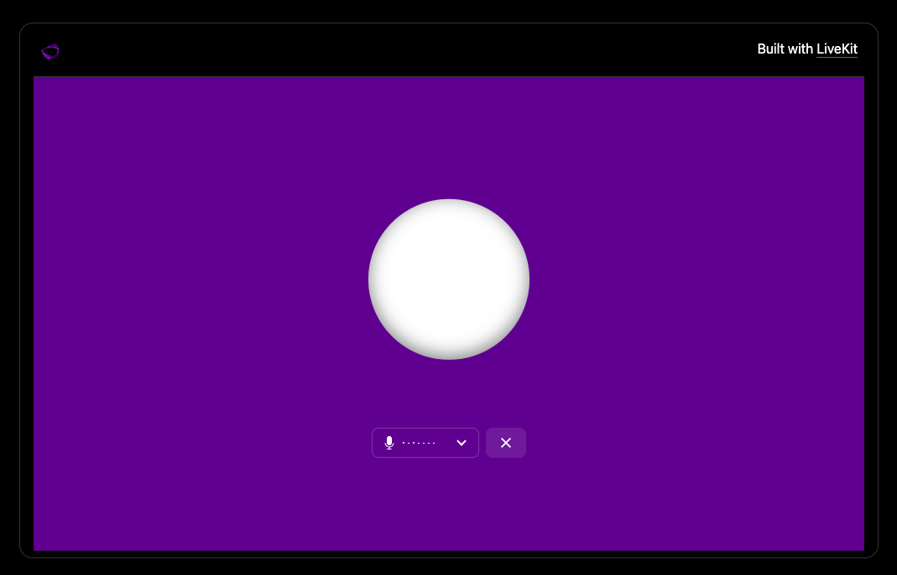

<a href="https://sambanova.ai/">
<picture>
 <source media="(prefers-color-scheme: dark)" srcset="../images/SambaNova-light-logo-1.png" height="60">
  
</picture>
</a>

# SambaNova Voice LiveKit assistant

## Overview

[LiveKit](https://github.com/livekit/livekit) provides scalable, multi-user conferencing based on WebRTC. It allows to build real-time video audio data capabilities. This example shows a voice agent running a pipeline of STT, LLM, using SambaNova's low-latency inference APIs.

## Setting up the Environment

### Agent
To get started, create a virtual environment and install the required dependencies and get the required env variables

1. Go to agent folder

``` bash
    cd agent
```

2. Create a Virtual Environment
Run the following commands to set up a virtual environment:

> Use python 3.9 or higher

``` bash
    python -m venv .venv
    source .venv/bin/activate
    pip install -r requirements.txt
```

3. Get and populate the required environment variables:

The Sambanova Livekit agent has 3 main components: 
- Speech To Text model: SambaCloud `Whisper-Large-v3` is used
- Large language model: SambaCloud LLMs are used here by default `"Llama-4-Maverick-17B-128E-Instruct` is set
- Text to Speech model: You can use Hume or Elevenlabs

To set and use these models generate your SambaCloud API key [here](https://cloud.sambanova.ai/apis), also get either a [Hume API Key](https://platform.hume.ai/settings/keys) or an [Elevenlabs API Key](https://elevenlabs.io/app/settings/api-keys)

To communicate LiveKit creates a room/session using LiveLit Cloud server, and both, the agent and the web client should join to the room, (find more [here](https://docs.livekit.io/agents/#how-agents-connect-to-livekit)), To create and set the LiveKit rooms create a project in [LiveKit Cloud](https://cloud.livekit.io/) then go to the settings panel and click on API Keys and create one.

Create a .env file running `cp .env.example .env` and populate it with your previously generated api keys

### Web client

1. Go to the web client folder

``` bash
    cd ../client/web
```

2. Install the pnpm dependencies

``` bash
    pnpm i
```

3. Get and populate the environment variables:

    create a .env.local file running `cp .env.example .env.local` ad populate it using same LiveKit variables you use in the Agent [set up step](#agent)

## Running the Voice Agent

1. Run the agent:

``` bash
    python main.py dev
```

2. run the web client

``` bash
   pnpm dev
```

> you can also run the agent without running the client by running `python main.py console`.

Then open [`http://localhost:3000`](`http://localhost:8000`) in your browser.
Select the multimodal agent and send a web page creation task to the agent.

You should see a page like this:



## Customize the agent

You can modify the agent’s behavior by tweaking the instructions, add tools or modify MCP servers [agent/main.py](./agent/main.py)

> For more complex examples, refer to the [official LiveKit Python examples repo](https://github.com/livekit-examples/python-agents-examples).
