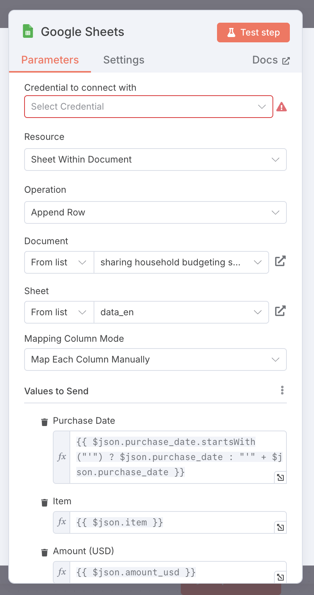

<a href="https://sambanova.ai/">
<picture>
  <source media="(prefers-color-scheme: dark)" srcset="../images/SambaNova-light-logo-1.png" height="60">
  
</picture>
</a>

# Household Budgeting Agentic Workflow (SambaNova Cloud + n8n)

This repository contains an agentic AI workflow built with [SambaNova Cloud](https://cloud.sambanova.ai/) and the low-code framework [n8n](https://n8n.io/), designed to help users manage their household expenses through a conversational interface.

## ✨ Overview

* This workflow is a simple yet effective example of an agentic AI application built with SambaNova Cloud and n8n.
* It enables users to manage household expenses through low-code automation and natural language interaction.
* It’s especially suitable for beginners exploring agentic AI and for showcasing the real-world value of agentic workflows without writing any code.

## 🔧 Requirements

* [n8n](https://n8n.io/) (cloud or self-hosted)
* Google account (for Google Sheets integration)
* [SambaNova Cloud](https://cloud.sambanova.ai) API key

## 🚀 How It Works

1. **User submits receipt data** via a chat interface.
2. **SambaNova Cloud LLM** parses the content and outputs structured information (e.g., item, amount, date).
3. The agent **asks the user to confirm the output**.
4. If confirmed, the data is **automatically logged** into Google Sheets.
5. If not confirmed or if the information is inaccurate, the agent **asks for corrections** and retries the process.

## 📦 Files

* `household_budgeting_agent.json`
  → The main n8n workflow.
* `sample.csv`
  → A sample template representing the target Google Sheets structure used in this workflow.

## 🛠️ Setup

Follow the steps below to import and run the workflow in your own n8n environment.

### 1. Prepare your environment

* Create an account on [n8n](https://n8n.io/) (cloud or self-hosted).
* Create a new spreadsheet in Google Sheets using the same column structure as `sample.csv`.
* Get your API key from [SambaNova Cloud](https://cloud.sambanova.ai).

### 2. Import the workflow

* In your n8n dashboard, click **"Create Workflow"**.
* Click the **three-dot menu (⋯)** in the top-right corner and select **"Import from File..."**.
* Upload the file `household_budgeting_agent.json`.


### 3. Set up Chat Model nodes

* Open each **Chat Model** node in the workflow.
* Open the Credential menu and add your SambaNova Cloud `API key` and `Base URL` https://api.sambanova.ai/v1. (Note that SambaNova Cloud supports OpenAI-compatible APIs.)
* In the `Model` list, select an appropriate model, e.g., `Llama-4-Maverick-17B-128E-Instruct`.

#### Example: Chat Model configuration


### 4. Set up Google Sheets node
* In the **Google Sheets** node, set up your **Google Sheets credentials**.
* Specify the appropriate `Document` and `Sheet` that match your spreadsheet.
* Under `Values to Send`, make sure to specify the correct column names.

#### Example: Google Sheets configuration


### 5. Run and test

* In the workflow editor, click the **"Open Chat"** button located near the bottom center to open the Chat panel.
* In the **Chat interface**, enter any receipt information in natural language.
  For example:

  ```
  today, tea, 7-Eleven, 2 USD
  ```
* Follow the conversation with the agent until the entry is successfully confirmed.
* Go to your spreadsheet in Google Sheets and verify that the data has been correctly added.
