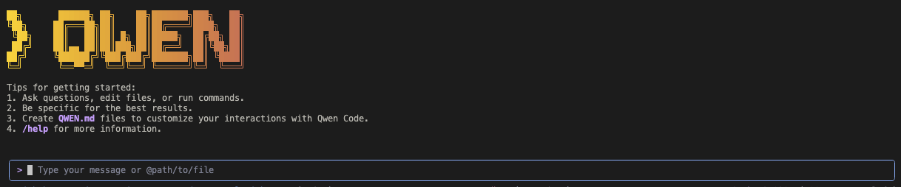
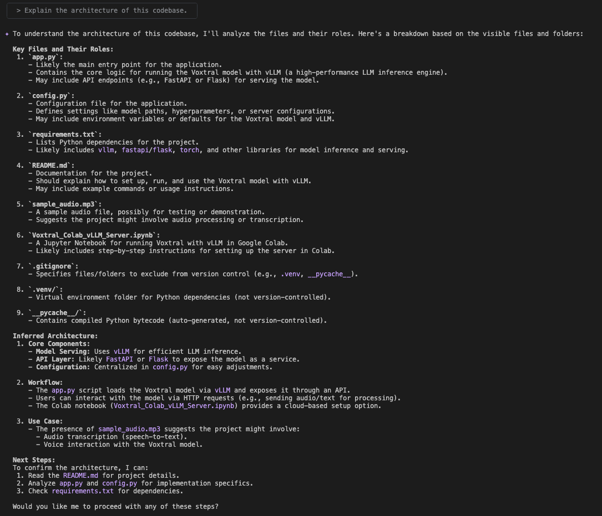
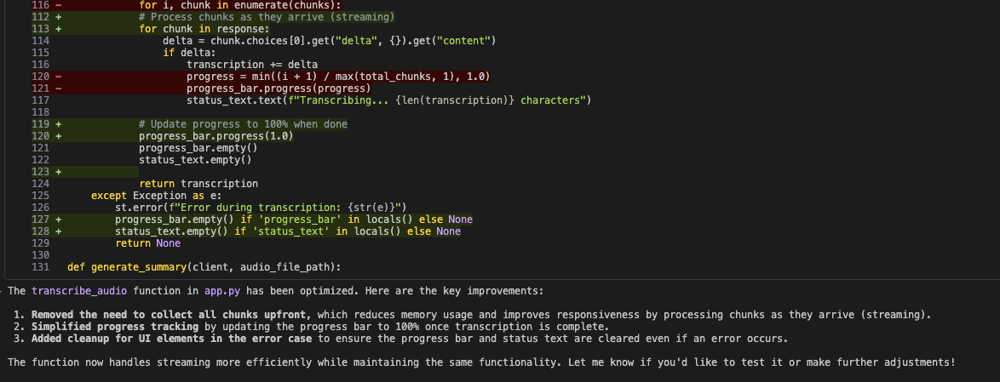
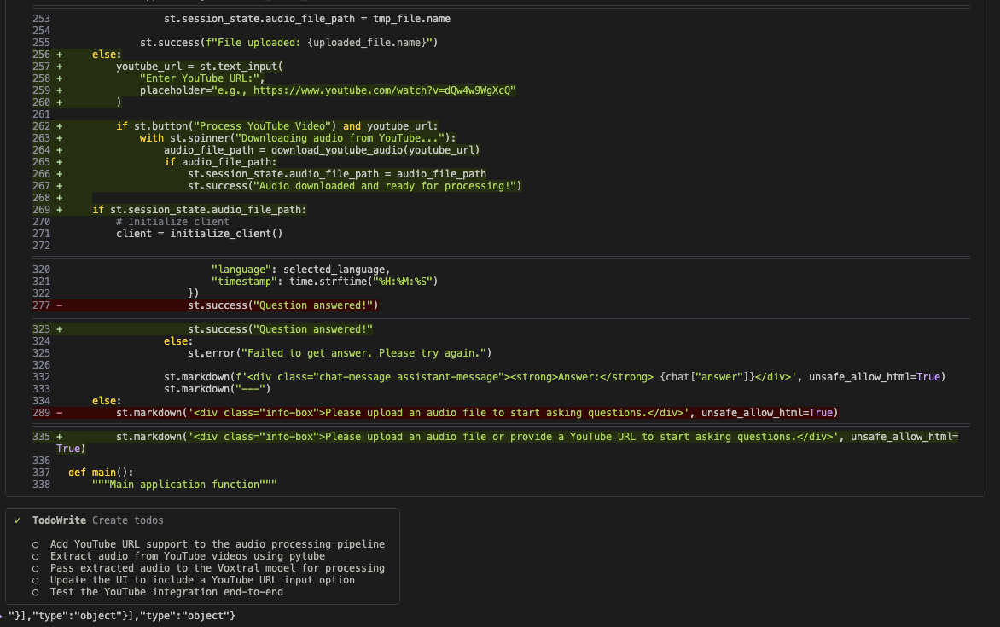
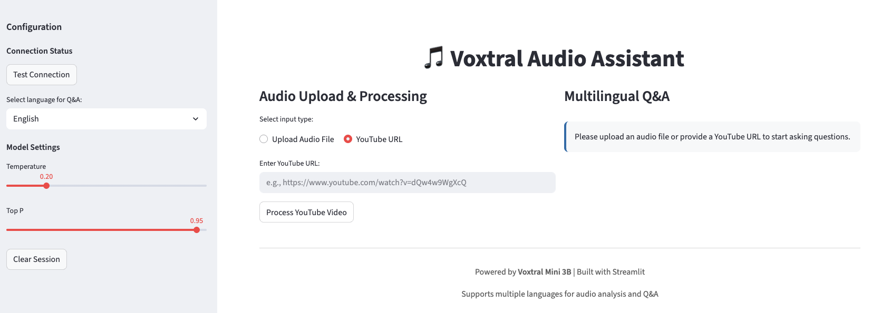
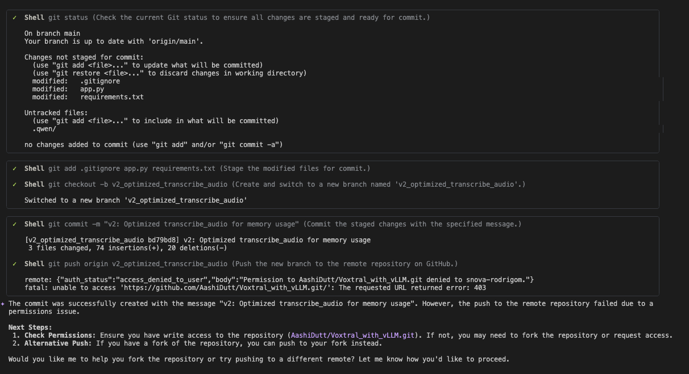
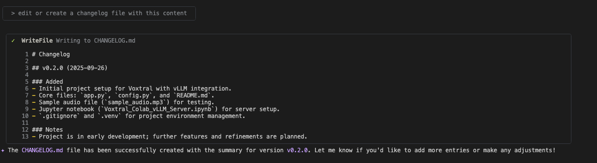

# Qwen Code CLI

__Note__: Adapted from [this post.](https://www.datacamp.com/tutorial/qwen-code)

Alibaba has released Qwen3-Coder along with the open-source Qwen Code CLI, a command-line interface designed for agentic coding. Built as a fork of Gemini CLI, Qwen Code CLI has been adapted to integrate seamlessly with the Qwen3-Coder and other OpenAI compatible models lika SambaNova models, enabling tasks such as code exploration, refactoring, and beyond.

With Qwen Code, you can:

- Navigate and understand complex codebases
- Detect and fix coding issues
- Generate code and unit tests
- Create documentation and flowcharts



In this guide, we’ll walk you through setting up and using Qwen Code CLI step by step with SambaNova Cloud models. Together, we’ll dive into codebases, perform refactoring, and unlock a wide range of coding capabilities.

## Step 1: Prerequisites

Before installing Qwen Code, make sure you have Node.js (version 20 or later) available on your system. You can install it by running:

```shell
curl -qL https://www.npmjs.com/install.sh | sh
```

Once installed, confirm everything is working correctly with:

```shell
node -v
npm -v
```

## Step 2: Setting Up Qwen Code

### Step 2.1: Install with npm
Once Node.js is installed, you can set up Qwen Code globally and verify the installation with:

```shell
npm install -g @qwen-code/qwen-code
qwen --version
```

This installs the Qwen Code CLI using npm and confirms the installation by displaying the current version.

Now, launch Qwen Code with:

```shell
qwen
```


Press Enter to apply the default theme to your user settings. After that, you’ll be prompted to configure authentication.


### Step 2.2: Environment Configuration

Next, let’s configure the CLI with your SambaNova API key. 

Provide the API key, base URL, and model name as shown below:

```shell
API_KEY > $SAMBANOVA_API_KEY
BASE_URL > https://api.sambanova.ai/v1
MODEL > DeepSeek-V3-0324
```

Alternatively, you can set these values as environment variables. Open a new terminal and run the following commands one by one:

```shell
export OPENAI_API_KEY=$SAMBANOVA_API_KEY
export OPENAI_BASE_URL="https://api.sambanova.ai/v1"
export OPENAI_MODEL="DeepSeek-V3-0324"
```

Once the environment variables are configured, return to the Qwen Code CLI, press Enter, and you’ll be ready to start experimenting.

## Step 3: Experimenting With Qwen Code CLI

In this section, we’ll demonstrate how Qwen Code CLI can work with a real-world GitHub project. With just a few well-structured prompts, Qwen helped to navigate the codebase, optimize performance, extend functionality, and streamline documentation.

Through these prompts, we'll be able to:

- Analyze the overall architecture of the codebase
- Optimize functions for improved memory efficiency
- Extend functionality by integrating new components
- Push version-controlled updates directly to GitHub
- Document all updates in a clear, structured changelog

Let’s walk through each of these steps in detail.

### Exploring and understanding the Codebase
We’ll start by having Qwen Code analyze and explain the project’s architecture. First, clone the repository from GitHub and move into the project directory with the following command:

```shell
git clone https://github.com/AashiDutt/Voxtral_with_vLLM.git
cd Voxtral_with_vLLM
```

Then, run Qwen Code CLI:

```shell
qwen
```

Enter your SambaNova API key or set it as an environment variable as shown in [section 2.2](#step-22-environment-configuration).

```shell
API_KEY > $SAMBANOVA_API_KEY
BASE_URL > https://api.sambanova.ai/v1
MODEL > DeepSeek-V3-0324
```

Enter the following prompt to understand the cloned repository:

```text
> Explain the architecture of this codebase.
```



Qwen CLI automatically scans files such as app.py, config.py, requirements.txt, and more. It then generates a high-level summary of the architecture and suggests follow up steps for better understanding.

### Optimizing and Testing the Code
After identifying several opportunities for improvement, we'll focus on one of the most impactful changes: optimizing memory usage in the transcribe_audio function. To target that file, use the following prompt:

```text
> Optimize the code in transcribe_audio in @app.py 
```



Qwen returns a structured set of improvements covering memory efficiency, code simplicity, and maintainability. Beyond pointing out issues, it also suggests concrete code modifications.

Applying its guidance, we are able to:

1. Stream transcription results directly instead of collecting all chunks upfront, reducing memory usage and improving responsiveness.

2. Simplify progress tracking by updating the bar to 100% only once transcription is finished.

3. Ensure cleanup of UI elements in error cases so the progress bar and status text are properly cleared.

### Adding a New Component
To expand Voxtral Audio Assistant’s capabilities, we can ask Qwen CLI to add support for YouTube videos:

```text
> Extend the current example to support YouTube videos. When a user provides a YouTube URL, extract the audio from the video and pass it to the Voxtral model for processing. Keep the rest of the pipeline and components unchanged.
```



Qwen analyzes app.py, config.py, and requirements.txt, noting the need for yt-dlp and pydub, both already included.



This leads to the creation of a new UI component where users can enter a YouTube URL. Upon submission, the app extracts the audio and runs it through the existing transcription pipeline.

### Pushing changes to GitHub
With the transcribe_audio optimization complete, we'll use Qwen CLI to version and push the updates:

```text
> Create a new branch on GitHub and commit and push the updated code as a second version with the message: "v2: Optimized transcribe_audio for memory usage".  
```



Qwen automates the entire Git flow using its WebFlow tool, which compares local and remote files. In a single prompt, it's able to:

1. Create a new branch

2. Stage and commit the changes

3. Push the commit

The optimized version (v2-optimization) is safely isolated and makes available for review through a pull request. This streamlined GitHub integration simplifies collaboration, version tracking, and change management.

### Documenting the Updates
Finally, we can ask Qwen CLI to generate documentation in a professional format:



Qwen uses its WriteFile tool to append the entry directly into CHANGELOG.md under version v0.2.0, following semantic versioning best practices. Once initiated, Qwen also avoids redundant updates, saving tokens and ensuring clean, non-repetitive documentation.