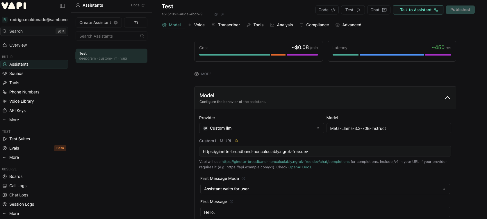

# Connecting SambaNova as Custom LLM to Vapi

This repository documents how to connect a **SambaNova LLM server** as a custom LLM to **Vapi** using SambaNova’s `Meta-Llama-3.3-70B-Instruct` model. The guide walks you through setting up a local Flask server, exposing it with **Ngrok**, configuring **Vapi Custom LLM**, and understanding the end-to-end communication flow.

This setup is useful for:

* Testing custom LLM logic locally
* Adding middleware, logging, or prompt control
* Running your own inference or proxy layer behind Vapi

---

## Prerequisites

Before starting, make sure you have the following:

* **SambaNova API Key** - Access to SamabaNova's LLMs. For that, please visit the [SambaNova Cloud page](https://cloud.sambanova.ai/apis)
* **Vapi Account** – Access to the Vapi Dashboard. For that, create a Vapi account [here](https://dashboard.vapi.ai/login) 
* **Python 3.11+** – Local development environment
* **Python dependencies**:

```bash
pip install flask sambanova
```
* **Ngrok** – To expose your local server to the internet. For installation, please run the following in MacOS. For more information, go [here](https://ngrok.com/download/mac-os?adobe_mc=MCMID%3D14000493784186094640990814905405683999%7CMCORGID%3DA8833BC75245AF9E0A490D4D%2540AdobeOrg%7CTS%3D1762646400).

```bash
brew install ngrok
```

Then, get your ngrok auth token and add it with the following. For more information, follow [this](https://dashboard.ngrok.com/get-started/your-authtoken):

```bash
ngrok config add-authtoken $YOUR_NGROK_AUTHTOKEN
```
* **Flask App Code** – Vapi server-side [example here](./app.py)

---

## Step 1: Set Up a Local LLM Server

### 1. Create a Flask Application

Use the file called `app.py` [here](./app.py), which forwards incoming chat requests to a SambaNova-hosted LLM using SambaNova's SDK. It accepts standard chat parameters, cleans up Vapi-specific field structure from the request, and then either streams tokens back to the client using Server-Sent Events or returns a full JSON response in one shot. 

---

### 2. Run the Server

```bash
python app.py
```

The server will start on:

```
http://localhost:5000
```

---

### 3. Expose the Server Using Ngrok

In a separate terminal:

```bash
ngrok http 5000
```

Ngrok will generate a public URL similar to:

```
https://abcd-1234.ngrok-free.dev
```

This is the endpoint Vapi will call.

Test your endpoint with a cURL like the following

```
curl -X POST https://abcd-1234.ngrok-free.dev/chat/completions \
  -H "Content-Type: application/json" \
  -d '{
    "call": "chat.completions",
    "metadata": {
      "request_id": "example-123"
    },
    "model": "Meta-Llama-3.3-70B-Instruct",
    "messages": [
      {
        "role": "system",
        "content": "You are a helpful assistant."
      },
      {
        "role": "user",
        "content": "Hello! Explain what an LLM is in one sentence."
      }
    ],
    "temperature": 0.7,
    "max_tokens": 150,
    "stream": true
  }'
```

---

## Step 2: Configure Vapi Custom LLM

1. Log in to the **Vapi Dashboard**
2. Create an **Assistant** with a Blank Template
2. Navigate to **Model → Provider → Custom LLM**
3. Introduct the **Model name** you'll use.
4. Paste your **Ngrok URL** into the endpoint URL field

   ```
   https://abcd-1234.ngrok-free.dev/chat/completions 
   ```
5. Save the configuration

Reference image:


### Test the Integration

* Send a test message using the **Chat** or **Talk to Assistant** options from Vapi
* Confirm the request reaches your local Flask server
* Verify the response is returned and displayed correctly in Vapi

## Step 3: Understanding the Communication Flow

1. **User sends a message in Vapi**
2. **Vapi sends a POST request** to your Ngrok endpoint
3. **Flask server receives the request**
4. **Conversation data is parsed** and transformed
5. **SambaNova API is called** (`Meta-Llama-3.3-70B-Instruct`)
6. **Response is formatted** for Vapi
7. **Vapi displays the response** to the user

---

## Notes & Best Practices

* Ngrok URLs change on restart (unless using a paid plan)
* Use environment variables for secrets
* Validate request payloads from Vapi
* Add logging for debugging and observability
* Follow the official Vapi response schema strictly

## References

* [Vapi Custom LLM Documentation](https://docs.vapi.ai/customization/custom-llm/using-your-server)

* [SambaNova SDK Documentation](https://sambanova.ai/blog/introducing-the-sambanova-sdk)

---

Happy building 🚀
